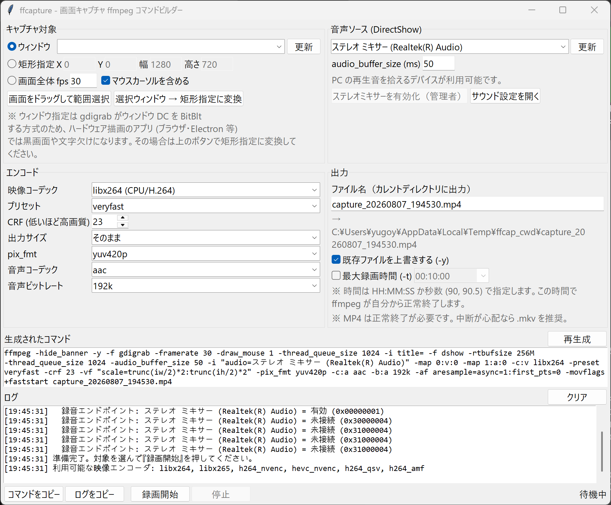

# ffcapture

Windows 用の画面キャプチャ **ffmpeg コマンドラインビルダー**（Tkinter GUI）。

生成されるのは素の `ffmpeg` コマンドなので、GUI から直接録画してもいいし、
コピーしてバッチやタスクスケジューラに貼ってもそのまま動きます。



## 必要なもの

- Windows 10 / 11
- Python 3.10 以降（`python.exe` / `pythonw.exe`）— **依存パッケージなし。標準ライブラリのみ**
- [ffmpeg](https://www.gyan.dev/ffmpeg/builds/) — **PATH を通しておくこと**。生成されるコマンドは
  フルパスではなく素の `ffmpeg` で始まるので、そのまま他の PC にも貼れます

## 使い方

**`ffcapture.pyw` をダブルクリック**すれば GUI が開きます。拡張子が `.pyw` なので
`pythonw.exe` で起動し、黒いコンソール窓は出ません。

```console
pythonw ffcapture.pyw            ダブルクリックと同じ（コンソール窓なし）
python  ffcapture.pyw            コンソール付きで起動（ログを端末でも見たいとき）
python  ffcapture.pyw --list     音声エンドポイントと DirectShow デバイスを一覧表示
```

### ダブルクリックが効かないとき

`.pyw` に関連付けが無いと、Windows は「このファイルを開く方法を選んでください」を出します。
python.org 版の Python は既定で関連付けますが、**Microsoft Store 版では `.pyw` が
未設定のまま**のことがあります。その場合は一度だけ実行してください:

```console
python ffcapture.pyw --register-pyw     .pyw を pythonw.exe に関連付ける
python ffcapture.pyw --unregister-pyw   取り消す
```

`HKCU\Software\Classes` に書くだけなので管理者権限は不要です。ただし
**この PC の `.pyw` ファイル全体**が対象になる点だけ注意してください
（現在の割り当ては `--list` の末尾で確認できます）。

## できること

### 映像（gdigrab）

| モード | 生成されるオプション |
| --- | --- |
| ウィンドウ | `-f gdigrab -i title=<ウィンドウタイトル>` |
| 矩形指定 | `-f gdigrab -offset_x X -offset_y Y -video_size WxH -i desktop` |
| 画面全体 | `-f gdigrab -i desktop` |

- ウィンドウ一覧は EnumWindows で列挙（非表示の UWP ウィンドウは除外）
- 画面をドラッグして範囲を選ぶオーバーレイ付き。マルチモニタの負座標にも対応
- プロセスを DPI aware にしてあるので、拡大表示（125% / 150%）でも座標がずれない

> **ウィンドウ指定の注意**
> gdigrab のウィンドウ指定はウィンドウ DC を BitBlt する方式のため、ハードウェア描画の
> アプリ（ブラウザ・Electron・ゲーム等）では黒画面や文字欠けになります。
> その場合は「選択ウィンドウ → 矩形指定に変換」ボタンで矩形指定に切り替えてください。

### 音声（DirectShow）

`-f dshow -i audio="<デバイス名>"` を組み立てます。デバイス一覧は
`ffmpeg -list_devices true -f dshow -i dummy` から取得します。

**PC で再生中の音**を録るにはステレオミキサー等のループバック用デバイスが必要です。
Realtek などのドライバが持っていても既定で無効化されていることが多いため、
このツールはレジストリ
（`HKLM\SOFTWARE\Microsoft\Windows\CurrentVersion\MMDevices\Audio\Capture`）の
`DeviceState` を読んで状態を判定します。

| DeviceState | 意味 |
| --- | --- |
| `0x00000001` | 有効 |
| `0x10000001` | 無効（ユーザーが無効化） |
| `0x0000000?4` | 未接続（過去のハードウェアの残骸） |
| `0x00000008` | プラグ未挿入 |

無効なステレオミキサーが見つかった場合は「ステレオミキサーを有効化（管理者）」ボタンが
有効になります。押すと UAC 付きの PowerShell で `DeviceState=1` に書き換え、
`AudioEndpointBuilder` を再起動してから再列挙します（数秒だけ音が途切れます）。

ステレオミキサー自体が存在しない構成では、
[VB-CABLE](https://vb-audio.com/Cable/) や
[screen-capture-recorder](https://github.com/rdp/screen-capture-recorder-to-video-windows-free)
（`virtual-audio-capturer`）を導入すると同じ方法で録音できます。

### エンコード

`libx264` / `libx265` / `h264_nvenc` / `hevc_nvenc` / `h264_qsv` / `h264_amf` に対応。
起動時に `ffmpeg -encoders` を叩いて、実際に使えるものだけを候補に出します。
品質指定（CRF / CQ / QP / global_quality）はエンコーダごとに適切なオプションへ振り分けます。

### 出力先

**カレントディレクトリに出力します。** 指定するのはファイル名だけで、保存先ダイアログはありません。
生成されるコマンドの末尾も `capture_20260807_194530.mp4` のような相対パスになるので、
コピーして別のフォルダやバッチに貼れば、そのフォルダに出ます。

GUI から実行した場合の「カレントディレクトリ」は ffcapture を起動したフォルダです
（ダブルクリック起動なら `ffcapture.pyw` が置いてあるフォルダ）。
実際の絶対パスはファイル名欄の下に表示され、録画開始時にもログへ出します。

### 最大録画時間

「最大録画時間 (-t)」をチェックすると `-t <時間>` を出力側に付けます。
指定した時間が経つと ffmpeg が自分から**正常終了**するので、MP4 でもファイルが壊れません。

- 書式は `HH:MM:SS`（例 `00:05:00`）か秒数（例 `300`、`90.5`）
- 入力欄の右に解釈結果が秒で表示され、書式が不正なら赤字で警告します
- 録画開始時に自動終了の予定時刻をログに出します

## 生成されるコマンドの例

```
ffmpeg -hide_banner -y -f gdigrab -framerate 30 -draw_mouse 1 -thread_queue_size 1024 ^
  -offset_x 100 -offset_y 200 -video_size 1280x720 -i desktop ^
  -f dshow -rtbufsize 256M -thread_queue_size 1024 -audio_buffer_size 50 ^
  -i "audio=ステレオ ミキサー (Realtek(R) Audio)" ^
  -map 0:v:0 -map 1:a:0 -c:v libx264 -preset veryfast -crf 23 ^
  -vf "scale=trunc(iw/2)*2:trunc(ih/2)*2" -pix_fmt yuv420p ^
  -c:a aac -b:a 192k -af aresample=async=1:first_pts=0 ^
  -movflags +faststart capture_20260807_194530.mp4
```

## 停止のしかた

GUI の「停止」は ffmpeg の標準入力に `q` を送って正常終了させます（応答がなければ
CTRL_BREAK → 強制終了の順にフォールバック）。MP4 は正常終了しないと壊れるため、
中断が心配な場合は `.mkv` で出力してください。
